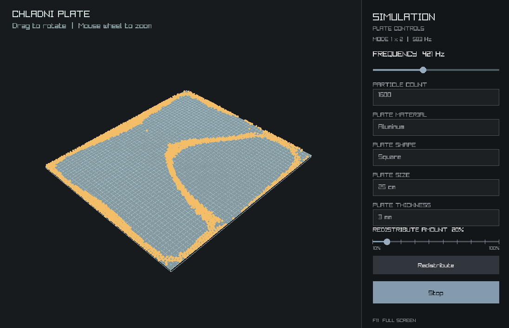

# Chladni Plate Simulation

An interactive C++/Raylib prototype for a vibrating Chladni plate and granular sand visualization. The application lets you change plate material, outline, size, thickness, particle count, drive frequency, and redistribution percentage.

<!-- Add the project screenshot at this path when it is available. -->



> This is an educational, physically inspired approximation. It is not a finite-element solver or a calibrated reproduction of a laboratory plate.

## Features

- Rotatable 3D plate with square, circular, pentagonal, and hexagonal outlines.
- Material presets for steel, aluminum, and brass.
- Selectable plate size from 20 to 40 cm and thickness from 2 to 6 mm.
- Particle-count presets of 400, 800, 1,600, and 3,200 grains.
- Modal field built from a driven plate mode and nearby resonances.
- Falling grains with gravity, approximate grain collisions, plate contact, friction, edge response, and nodal drift.
- Random redistribution of 10% to 100% of the grains resting on the plate into a user-selected section.
- Resizable window and F11 fullscreen toggle.

## Technology

- **C++17** for the application, screen architecture, and simulation.
- **Raylib 5.5** for windowing, input, camera, and 2D/3D rendering.
- **rlgl**, shipped with Raylib, for batched triangle and line geometry.
- **CMake 3.20+** for configuration.
- **Ninja** is selected by the `debug` and `release` CMake presets.

Raylib must be installed and discoverable by `find_package(raylib REQUIRED)`. On Windows, the project has been built with the MSYS2 UCRT64 toolchain. A C++17 compiler, CMake, Ninja, and the Raylib development package are required.

## Build and Run

From PowerShell, in the project root:

```powershell
cmake --preset debug
cmake --build build/debug
.\build\debug\HelloRaylib.exe
```

For an optimized build:

```powershell
cmake --preset release
cmake --build build/release
.\build\release\HelloRaylib.exe
```

The presets configure the project into `build/debug` and `build/release`. The supplied presets are configure presets; build commands therefore name the output directory explicitly.

## Controls

- **F11**: toggle fullscreen.
- **Left-drag over the scene**: orbit the camera around the plate.
- **Mouse wheel**: zoom in or out.
- **Frequency slider**: choose a drive frequency from 40 to 1,000 Hz.
- **Particle count**: choose 400, 800, 1,600, or 3,200 particles.
- **Plate material**: choose steel, aluminum, or brass.
- **Plate shape**: choose square, circular, pentagonal, or hexagonal.
- **Plate size**: choose 20, 25, 30, 35, or 40 cm. For a square, this is the side length; for the other outlines, it is the diameter.
- **Plate thickness**: choose 2, 3, 4, 5, or 6 mm.
- **Redistribute amount**: choose 10% through 100% in 10% increments.
- **Redistribute**: click the button, then click a valid section of the plate. The chosen fraction of grains touching the plate is randomly selected and gradually emitted above that section. Airborne grains are not included.
- **Start / Stop**: begin or stop the pour and simulation.
- **Escape** or **right-click** while selecting a redistribution section: cancel section selection.

Particle count, material, shape, size, and thickness are locked while the simulation is running. Changing geometry resets the stopped particle pile so grains from the previous geometry are not retained.

## Project Layout

```text
src/
  main.cpp                    Raylib startup, window settings, and application loop.
  core/
    Screen.h                  Common interface for application views.
    ScreenManager.h/.cpp      Owns and dispatches to the active view.
  screens/
    SimulationScreen.h/.cpp   Sidebar, plate, modal field, particles, and interactions.
assets/
  chladni-preview.png         Optional screenshot referenced at the top of this document.
CMakeLists.txt                C++ target and Raylib dependency.
CMakePresets.json             Debug and release configure presets.
```

`main.cpp` knows only about `ScreenManager` and the initial simulation screen. New views can implement `Screen` and be installed through `ScreenManager::SetScreen`.

## Mathematical Model

### Thin-Plate Material Properties

For a homogeneous, isotropic plate with thickness $h$, Young's modulus $E$, density $\rho$, and Poisson ratio $\nu$, the flexural rigidity estimate is:

$$
D = \frac{E h^3}{12(1-\nu^2)}
$$

The mass per unit area is:

$$
\mu = \rho h
$$

The code uses the characteristic bending-wave speed:

$$
c_p = \sqrt{\frac{D}{\mu}}
$$

These properties are read from the selected material preset. Thickness affects both the cubic rigidity term and areal mass; size affects the modal wavenumbers.

### Natural Frequencies

For the square plate, the implementation uses the simply supported rectangular thin-plate approximation. Given integer mode indices $m,n$ and side lengths $a,b$:

$$
f_{mn} = \frac{\pi}{2} c_p \left[\left(\frac{m}{a}\right)^2 + \left(\frac{n}{b}\right)^2\right]
$$

The square uses the selected side length for both axes. Circle, pentagon, and hexagon use an approximate radial/angular wavenumber model; pentagon and hexagon receive small shape correction factors. These are useful for demonstrating trends, not exact eigenfrequencies for a particular support or material setup.

`GetMode` searches integer mode indices from 1 through 8 and chooses the estimated natural frequency closest to the selected drive frequency.

### Modal Field and Resonance

`BuildPlateModeField` combines up to eight candidate modes: the nearest mode, a transposed/degenerate mode, and nearby index pairs. Each basis mode is weighted by its excitation at an off-center source and by a damped-oscillator response. For frequency ratio $r=f/f_n$ and damping ratio $\zeta$, the response denominator is:

$$
(1-r^2)^2 + (2\zeta r)^2
$$

The in-phase and quadrature terms are combined with the source coupling to form each signed modal weight. Their weighted basis functions are sampled into a 49 × 49 scalar field. `GetPlateModeShape` uses bilinear interpolation, so the surface mesh and the grain forces share the same nodal contours.

The visual oscillation is intentionally slowed to 2–8 cycles per second even though the selected frequency can reach 1,000 Hz. The selected frequency still determines mode selection and resonant response; slowing only the visible phase makes the motion legible at the application's frame rate. Surface displacement is also exaggerated for visibility.

### Particle Integration and Collisions

- Rendering targets 30 FPS. Physics uses a fixed $1/60$ second time step, independent of frame rate, with up to eight catch-up substeps.
- The frame time consumed by the simulator is capped at 0.05 seconds to prevent an unbounded catch-up spiral.
- The feeder emits up to 900 grains per simulation second from above the center or the selected redistribution section.
- Each grain is advanced with semi-implicit Euler integration: velocity is updated by gravity, then position is advanced by velocity.
- Near the plate, finite differences estimate the modal-field gradient. A force proportional to $-\nabla(A^2)$ approximates drift away from antinodes and toward nodal lines.
- Contact clamps each sphere to the plate top, applies a small rebound, and damps horizontal speed with exponential friction.
- A broad-phase spatial grid stores particle linked lists. Each grain checks its own cell and eight adjacent cells instead of testing every possible pair.
- Grain contacts use equal-mass positional correction and a low-restitution impulse along the contact normal. Tangential grain friction, cohesion, humidity, and grain-size variation are not modeled.
- The redistribution operation samples only grains marked as touching the plate. Partial Fisher-Yates sampling selects the requested percentage without shuffling the entire candidate list.

## Known Limitations

- The plate is not solved with FEM. Non-square mode shapes and polygon corrections are approximations.
- The frequency slider and visual phase are not a calibrated physical shaker. The displayed Hz selects an approximate natural mode; visible oscillation is slowed.
- Gravity and particle dimensions are expressed in scene units. The application scale is not a metrology calibration.
- Plate support conditions, clamps, excitation location/force, grain mass, and acoustic effects are simplified or omitted.
- Increasing particle count increases integration, collision, and rendering work. The spatial grid reduces neighbor checks but does not make the simulation cost-free.

## Extending the Presets

Material, shape, size, and thickness tables are defined near the top of `src/screens/SimulationScreen.cpp`. Keep each table's label/value arrays and option counts aligned. A new plate shape also needs consistent implementations for its outline vertices, point-in-shape test, natural-frequency approximation, mode basis, and edge collision response.
